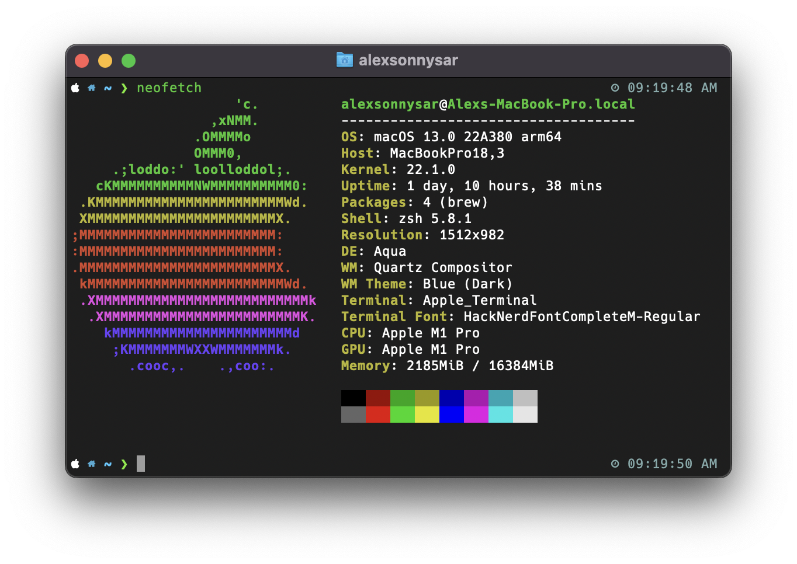
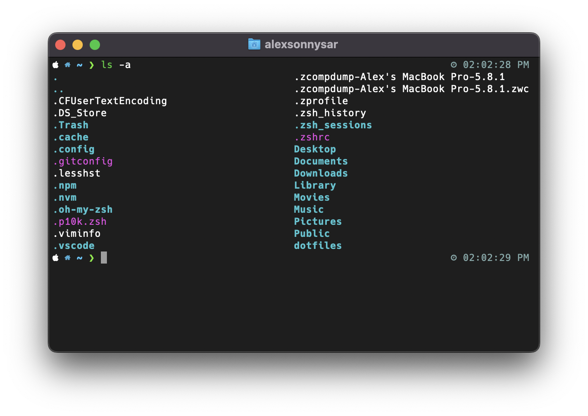

# dotfiles <!-- omit in toc -->

How I setup my dotfiles on MacOS and Linux


## Table of Contents <!-- omit in toc -->
- [Installation](#installation)
- [Setting up MacBook](#setting-up-macbook)
- [Brewfile](#brewfile)
- [Stow](#stow)

## Installation
- [Homebrew](https://brew.sh/)
- [Stow](https://formulae.brew.sh/formula/stow#default)
- [Hack Nerd Font](https://github.com/ryanoasis/nerd-fonts)
- [Oh My Zsh](https://ohmyz.sh/)
  - [zsh-autosuggestions](https://github.com/zsh-users/zsh-autosuggestions)
  - [zsh-syntax-highlighting](https://github.com/zsh-users/zsh-syntax-highlighting)
- [Powerlevel10k](https://github.com/romkatv/powerlevel10k)

## Setting up MacBook
Download my dotfiles to your home directory
```
git clone https://github.com/alexsonnysar/dotfiles.git
```

## Brewfile
To generate a Brewfile run the following command
```
brew bundle dump
```

To install all packages from Brewfile run the following command
```
brew bundle
```

## Stow
The way stow works is that it will create system links in your `~/` directory. Run the following command in the `~/dotfiles` directory
```
stow [folder]
```

The following files in purple are symlinks from the actual files located within `~/dotfiles`. This may also be shown as an arrow depending on your terminal configuration


